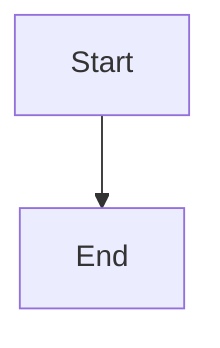
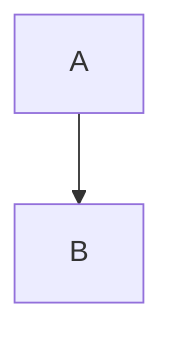

# Документация AI Writing System

Это полная документация AI Writing System, построенная с использованием MkDocs Material.

## 🚀 Быстрый старт

### Установка зависимостей

```bash
# Установка зависимостей документации
pip install -r docs-requirements.txt
```

### Локальный просмотр

```bash
# Запуск dev server
mkdocs serve

# Документация доступна на http://127.0.0.1:8000
```

### Сборка статической версии

```bash
# Сборка в директорию site/
mkdocs build

# Проверка битых ссылок
mkdocs build --strict
```

## 📁 Структура

```
docs/
├── index.md                    # Главная страница
├── getting-started/            # Начало работы
│   ├── installation.md
│   ├── quick-start.md
│   ├── core-concepts.md
│   └── faq.md
├── user-guide/                 # Руководство пользователя
│   ├── planning/              # Planning Workflow
│   ├── generation/            # Generation Workflow
│   ├── sessions/              # Session Management
│   ├── context/               # Context Management
│   └── commands/              # Команды
├── technical/                  # Техническая документация
│   ├── architecture/          # Архитектура
│   ├── agents/                # Агенты
│   ├── mcp/                   # MCP серверы
│   ├── hooks/                 # Hooks
│   └── prose/                 # Prose Style Guide
├── features/                   # Спецификации features
│   ├── feat-0001/             # Reliable Scene Generation
│   ├── feat-0002/             # Workflow State Tracking
│   └── feat-0003/             # Hierarchical Planning
├── api/                        # API Reference
│   ├── mcp-tools/             # MCP Tools
│   └── python/                # Python API
├── development/                # Разработка
│   ├── testing/               # Тестирование
│   └── contributing.md        # Contributing Guide
├── stylesheets/                # Кастомные CSS
├── javascripts/                # Кастомные JS
└── includes/                   # Переиспользуемый контент
    └── abbreviations.md       # Сокращения
```

## ✨ Возможности

### Интерактивная навигация

- **Tabs navigation** — секции верхнего уровня в горизонтальных табах
- **Instant loading** — SPA-like навигация без перезагрузки
- **Search** — полнотекстовый поиск с автодополнением
- **Breadcrumbs** — навигационные хлебные крошки

### Контент

- **Code highlighting** — подсветка синтаксиса для всех языков
- **Mermaid diagrams** — визуализация workflows и архитектуры
- **Admonitions** — красивые блоки для заметок и предупреждений
- **Tabs** — переключаемые вкладки для альтернативного контента
- **Card grids** — карточки для навигации

### Удобство

- **Dark/Light mode** — автоматическое переключение темы
- **Mobile responsive** — адаптивный дизайн для мобильных
- **Copy to clipboard** — кнопки копирования кода
- **Git revision dates** — автоматические даты обновления страниц

## 🎨 Кастомизация

### CSS

Кастомные стили в `docs/stylesheets/extra.css`:

- Agent cards
- MCP tool reference blocks
- Feature status badges
- Timeline styles
- Workflow diagrams

### JavaScript

Кастомные скрипты в `docs/javascripts/`:

- MathJax для математических формул
- Дополнительные интерактивные элементы

## 📝 Написание документации

### Использование Material компонентов

#### Grid Cards

```markdown
<div class="grid cards" markdown>

-   :material-rocket:{ .lg .middle } __Title__

    ---

    Description

    [:octicons-arrow-right-24: Link](page.md)

</div>
```

#### Admonitions

```markdown
!!! tip "Заголовок"

    Содержимое

!!! warning "Предупреждение"

    Важная информация
```

#### Tabs

```markdown
=== "Tab 1"

    Content 1

=== "Tab 2"

    Content 2
```

#### Mermaid Diagrams

````markdown

````

### Сокращения

Автоматически раскрываются при наведении:

```markdown
MCP server uses API for communication
```

Определения в `docs/includes/abbreviations.md`.

## 🔧 Конфигурация

Основная конфигурация в `mkdocs.yml`:

- **theme**: Material theme с кастомными цветами
- **plugins**: Search, git-revision-date, minify
- **extensions**: Pymdownx, admonitions, code highlighting
- **nav**: Структура навигации

## 📚 Обновление существующих документов

При обновлении документации из `.workflows/`:

1. Конвертируйте markdown в формат MkDocs Material
2. Добавьте интерактивные элементы (cards, tabs, admonitions)
3. Создайте Mermaid диаграммы для сложных процессов
4. Обновите навигацию в `mkdocs.yml`

## 🚢 Deployment

### GitHub Pages

```bash
# Сборка и деплой
mkdocs gh-deploy

# Документация будет доступна на:
# https://ai-bible.github.io/book-alexa-right
```

### Mike (Versioning)

```bash
# Установка mike
pip install mike

# Создание версии
mike deploy 1.0 latest --update-aliases

# Деплой
mike set-default latest
mike deploy --push
```

## 🐛 Troubleshooting

### Ошибка: Module not found

```bash
# Переустановите зависимости
pip install --upgrade -r docs-requirements.txt
```

### Битые ссылки

```bash
# Проверка ссылок
mkdocs build --strict
```

### Mermaid не рендерится

Проверьте, что используете правильный fence:

````markdown

````

## 📄 Лицензия

Документация распространяется под той же лицензией, что и основной проект.

---

**Last Updated**: 2025-11-16
**MkDocs Version**: 1.5+
**Material Theme**: 9.5+
