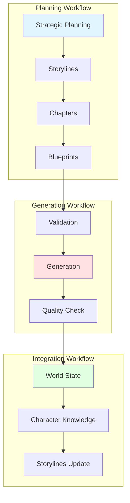
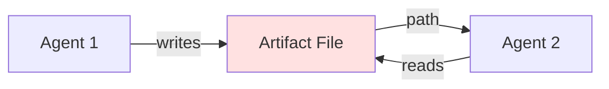
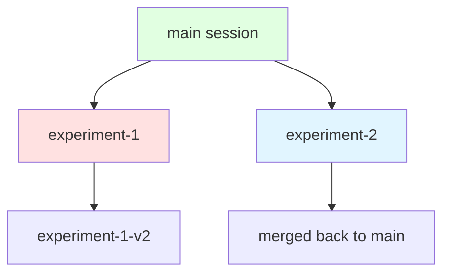

# Базовые концепции

Понимание ключевых концепций AI Writing System поможет вам эффективно использовать систему для создания романа.

## Архитектура высокого уровня

AI Writing System построена вокруг трёх основных workflows, которые работают вместе для создания романа:



## Ключевые концепции

### 1. :material-chart-timeline: Hierarchical Planning

Система использует иерархическое планирование из трёх уровней:

=== "Act Level"

    **Strategic Planning** — общее видение акта:

    - Основные сюжетные повороты
    - Эмоциональная дуга акта
    - Развитие конфликта
    - Начало и конец акта

    **Файл**: `acts/act-{N}/strategic-plan.md`

=== "Chapter Level"

    **Chapter Planning** — структура главы:

    - Последовательность сцен
    - Эмоциональная прогрессия
    - Character development
    - Subplot интеграция

    **Файл**: `acts/act-{N}/chapters/chapter-{NN}/plan.md`

=== "Scene Level"

    **Scene Blueprints** — детальный план сцены:

    - Characters и их goals
    - Conflicts и tension sources
    - Emotional arc
    - Dialogue plan
    - Sensory details

    **Файл**: `acts/act-{N}/chapters/chapter-{NN}/scenes/scene-{NNNN}-blueprint.md`

!!! info "Parent-Child Validation"

    Изменения на любом уровне автоматически инвалидируют дочерние элементы.

    Например:
    - Изменение Chapter Plan → все Scene Blueprints требуют пересмотра
    - Изменение Act Plan → все Chapters и Scenes требуют пересмотра

### 2. :material-robot: Specialized Agents

Система использует **специализированных агентов** для выполнения конкретных задач.

#### Planning Agents

| Агент | Задача | Входы | Выходы |
|-------|--------|-------|--------|
| `context-analyzer` | Анализирует текущее состояние мира | World bible, characters, events | Context summary |
| `scenario-generator` | Генерирует варианты развития | Context, goals | 3-5 scenarios |
| `arc-planner` | Разбивает сценарий на события | Chosen scenario | Event sequence |
| `beat-planner` | Детализирует сцены | Events | Scene blueprints |

#### Generation Agents

| Агент | Задача | Входы | Выходы |
|-------|--------|-------|--------|
| `blueprint-validator` | Валидирует blueprint перед генерацией | Blueprint file | Validation report |
| `prose-writer` | Генерирует литературный текст | Blueprint | Prose (Markdown) |
| `canon-guardian` | Проверяет соответствие канону | Prose, canon levels | Compliance report |
| `dialogue-analyst` | Проверяет качество диалогов | Prose | Dialogue quality report |

!!! tip "Single Responsibility Principle"

    Каждый агент выполняет **одну** чётко определённую задачу. Это обеспечивает:

    - Модульность и переиспользование
    - Лёгкость тестирования
    - Параллельное выполнение

### 3. :material-file-tree: Artifact System

Агенты **не передают данные напрямую** — вместо этого используются файлы (artifacts).



**Преимущества**:

- Предотвращает context overflow
- Обеспечивает observability (все промежуточные результаты сохранены)
- Позволяет отладку и восстановление

**Пример**:

```python
# Агент 1: Генерирует scenarios
scenarios_file = workspace / "artifacts" / "scenarios.json"
write_file(scenarios_file, scenarios)
return {"scenarios_path": str(scenarios_file)}

# Агент 2: Читает scenarios
scenarios = read_file(scenarios_path)
```

### 4. :material-account-check: Human-in-the-Loop

Критические решения **всегда** принимает человек:

| Этап | Решение | Автоматически? |
|------|---------|----------------|
| Выбор сценария | Какой из 3-5 вариантов развивать? | ❌ Человек |
| Verification plan approval | Начать генерацию? | ❌ Человек |
| Добавление новых элементов мира | Новый персонаж/локация? | ❌ Человек |
| Разрешение противоречий | Что важнее? | ❌ Человек |
| Финальное одобрение текста | Публиковать? | ❌ Человек |

!!! warning "Шаг 3 (Verification Plan) обязателен"

    Генерация текста **не начнётся** без вашего явного одобрения verification plan.

### 5. :material-database: Canon Levels

Система управляет консистентностью через **5 уровней канона**:

| Уровень | Название | Immutable? | Примеры |
|---------|----------|------------|---------|
| **0** | Immutable Core | ✅ Да | Законы физики, базовая география |
| **1** | Fundamental Lore | ✅ Да | История мира, major events |
| **2** | Established Canon | ⚠️ Осторожно | Персонажи, локации, технологии |
| **3** | Working Details | 📝 Можно менять | Detailing, minor characters |
| **4** | Draft Elements | 🔄 Свободно | Experiments, drafts |

!!! example "Пример канона"

    ```markdown
    # Babylon (вертикальный мегаполис)

    **Canon Level: 0** (Immutable Core)

    Основные параметры:
    - 300+ уровней высоты
    - Социальная стратификация по вертикали
    - Разное течение времени на уровнях
    ```

### 6. :material-source-branch: Session Management

Система сессий позволяет экспериментировать без риска:



**Особенности**:

- **Copy-on-Write**: Изменения в сессии не влияют на main
- **Branching**: Создание веток для альтернативных сценариев
- **Merging**: Объединение успешных экспериментов

**Команды**:

```bash
# Создать сессию
/session-create experiment-ending

# Активировать
/session-activate experiment-ending

# Вернуться к main
/session-activate main

# Слияние
/session-merge experiment-ending main
```

### 7. :material-state-machine: Workflow Orchestration

MCP сервер `workflow-orchestration` отслеживает прогресс и обеспечивает:

#### Sequential Enforcement

Нельзя пропустить шаги:

```
Step 1 ✅ → Step 2 ✅ → Step 3 ❌ → Step 4 ⛔ BLOCKED
```

#### Recovery After Failures

Автоматическое восстановление с последнего успешного шага:

```bash
/generation-state resume scene-0201
```

#### Retry Logic

До 3 автоматических попыток при временных сбоях:

```
Attempt 1/3... ❌ Failed (network error)
Attempt 2/3... ❌ Failed (timeout)
Attempt 3/3... ✅ Success
```

### 8. :material-speedometer: Performance

Система оптимизирована для параллельного выполнения:

=== "Planning Workflow"

    ```mermaid
    graph TB
        S[Scenario Selected] --> P1[World Details]
        S --> P2[Character Details]
        S --> P3[Dialogue Planning]
        S --> P4[Tension Design]
        P1 & P2 & P3 & P4 --> M[Merge Results]
    ```

    **Параллельно**: До 6 агентов одновременно (фаза 2-3)

=== "Generation Workflow"

    ```mermaid
    graph TB
        G[Prose Generated] --> V1[Canon Guardian]
        G --> V2[Character Consistency]
        G --> V3[Dialogue Analyst]
        G --> V4[Temporal Logic]
        G --> V5[Emotional Arc]
        G --> V6[Sensory Details]
        G --> V7[Plot Consistency]
        V1 & V2 & V3 & V4 & V5 & V6 & V7 --> R[Final Report]
    ```

    **Параллельно**: 7 валидаторов одновременно (Step 6)

**Ориентировочное время**:

- Planning: ~2-5 минут на сцену
- Generation: ~5-8 минут на сцену
- Full cycle: ~7-13 минут

## Следующие шаги

Теперь, когда вы понимаете ключевые концепции, погрузитесь в детали:

<div class="grid cards" markdown>

-   [:octicons-workflow-24: Planning Workflow](../user-guide/planning/workflow-overview.md)
-   [:octicons-gear-24: Generation Workflow](../user-guide/generation/workflow-overview.md)
-   [:octicons-server-24: MCP Servers](../technical/mcp/overview.md)
-   [:octicons-robot-24: Agents Reference](../technical/agents/overview.md)

</div>
