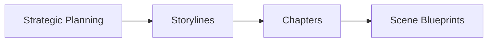
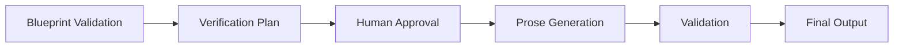
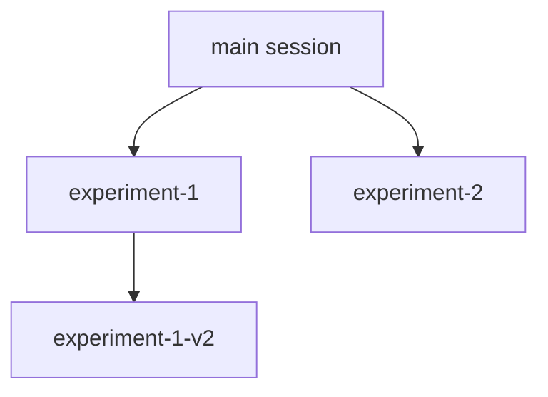

# Начало работы

Добро пожаловать в AI Writing System! Эта система поможет вам создать научно-фантастический роман с помощью специализированных ИИ-агентов.

## Что вас ждёт

В этом разделе вы узнаете:

-   :material-download:{ .lg .middle } __Установка__

    ---

    Настройка окружения и установка зависимостей

    [:octicons-arrow-right-24: Установить](installation.md)

-   :material-rocket-launch:{ .lg .middle } __Быстрый старт__

    ---

    Создайте первую сцену за 10 минут

    [:octicons-arrow-right-24: Начать](quick-start.md)

-   :material-school:{ .lg .middle } __Базовые концепции__

    ---

    Понимание архитектуры и workflow

    [:octicons-arrow-right-24: Изучить](core-concepts.md)

-   :material-help-circle:{ .lg .middle } __FAQ__

    ---

    Ответы на частые вопросы

    [:octicons-arrow-right-24: Читать](faq.md)

## Обзор системы

AI Writing System состоит из трёх основных workflow:

### 1. :material-chart-timeline: Planning Workflow

Интерактивное планирование сюжета с помощью команды `/plan-story`:

**Результат**: Детальный blueprint сцены, готовый для генерации текста.

### 2. :material-creation: Generation Workflow

Автоматическая генерация текста по blueprint:

**Результат**: Готовый литературный текст сцены в формате Markdown.

### 3. :material-source-branch: Session Management

Система версионирования для экспериментов:

**Результат**: Изолированные ветки для безопасного экспериментирования с сюжетом.

## Минимальные требования

!!! info "Системные требования"

    - Python 3.13+
    - Claude Code CLI
    - Git
    - 4GB RAM
    - 10GB свободного места на диске

## Рекомендуемое окружение

!!! tip "Рекомендации"

    - **ОС**: Linux, macOS, Windows (WSL2)
    - **Терминал**: Современный терминал с поддержкой Unicode
    - **Редактор**: VS Code с расширениями Markdown и Python
    - **Git**: Версия 2.30+

## Дальнейшие шаги

Готовы начать? Переходите к установке:

[Установка и настройка :octicons-arrow-right-24:](installation.md){ .md-button .md-button--primary }

---

!!! question "Нужна помощь?"

    Если у вас возникли вопросы, ознакомьтесь с [FAQ](faq.md) или откройте [issue на GitHub](https://github.com/ai-bible/book-alexa-right/issues).
