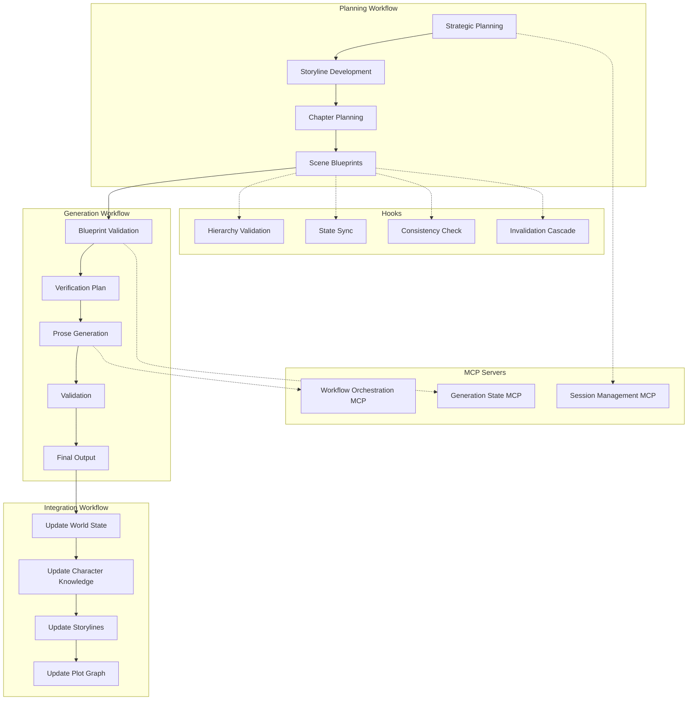

# AI Writing System Documentation

<div class="grid cards" markdown>

-   :material-rocket-launch:{ .lg .middle } __Быстрый старт__

    ---

    Установите систему и создайте первую сцену за 10 минут

    [:octicons-arrow-right-24: Начать](getting-started/quick-start.md)

-   :material-book-open-page-variant:{ .lg .middle } __Руководство пользователя__

    ---

    Полное руководство по планированию и генерации текста

    [:octicons-arrow-right-24: Читать](user-guide/index.md)

-   :material-code-braces:{ .lg .middle } __Техническая документация__

    ---

    Архитектура, агенты, MCP серверы и hooks

    [:octicons-arrow-right-24: Изучить](technical/index.md)

-   :material-api:{ .lg .middle } __API Reference__

    ---

    Полная документация API и MCP tools

    [:octicons-arrow-right-24: Справка](api/index.md)

</div>

## Что это?

**AI Writing System** — это полноценная система автоматизированного создания литературного текста для научно-фантастического романа с использованием специализированных ИИ-агентов и Model Context Protocol (MCP).

### Ключевые возможности

#### :material-chart-timeline: Планирование сюжета

Интерактивное многоуровневое планирование от стратегического видения акта до детальных сцен:

- **Strategic Planning** — план акта с основными поворотами сюжета
- **Storyline Development** — развитие сюжетных линий персонажей
- **Chapter Planning** — структура глав с эмоциональными арками
- **Scene Blueprints** — детальные blueprints для генерации

#### :material-creation: Генерация текста

Reliable workflow из 7 шагов для создания качественной литературной прозы:

1. **File Check** — проверка существования blueprint
2. **Blueprint Validation** — автоматическая валидация корректности
3. **Verification Plan** — утверждение плана проверки (human-in-the-loop)
4. **Generation** — создание текста (до 3 попыток с auto-retry)
5. **Fast Compliance Check** — быстрая поверхностная проверка (<30s)
6. **Full Validation** — глубокая валидация (7 валидаторов параллельно)
7. **Final Output** — финальный отчёт и сохранение результата

#### :material-source-branch: Управление версиями

Система сессий с Copy-on-Write для безопасных экспериментов:

- **Branching** — создание веток для альтернативных вариантов
- **Isolation** — каждая сессия работает в изолированном пространстве
- **Rollback** — откат к предыдущим версиям
- **Merge** — объединение успешных экспериментов

#### :material-database: Управление контекстом

Централизованное управление миром романа:

- **World Bible** — библия мира с уровнями канона (0-4)
- **Characters** — карточки персонажей с timeline и knowledge
- **Locations** — описания локаций с историей
- **Plot Graph** — граф сюжета с зависимостями событий

#### :material-state-machine: Workflow Orchestration

Отслеживание прогресса и автовосстановление:

- **Sequential Enforcement** — невозможно пропустить шаги
- **Human Checkpoints** — критические решения за человеком
- **Retry Logic** — автоматические повторные попытки при сбоях
- **Recovery** — восстановление после падений с последнего шага

### Архитектура



### Быстрые ссылки

<div class="grid cards" markdown>

-   :material-play-circle:{ .lg .middle } **Планирование**

    ---

    ```
    /plan-story
    ```

    Интерактивное создание плана сцены/главы/акта

-   :material-auto-fix:{ .lg .middle } **Генерация**

    ---

    ```
    Сгенерируй сцену 0204
    ```

    Автоматическая генерация текста по blueprint

-   :material-source-branch:{ .lg .middle } **Сессии**

    ---

    ```
    /session-create experiment-ending
    /session-activate experiment-ending
    ```

    Создание и управление ветками

-   :material-help-circle:{ .lg .middle } **Состояние**

    ---

    ```
    /generation-state status scene-0204
    /generation-state resume scene-0204
    ```

    Проверка прогресса и восстановление

</div>

## Производительность

!!! info "Ориентировочное время выполнения"

    - **Planning**: ~2-5 минут на сцену
    - **Generation**: ~5-8 минут на сцену (включая human approval ~30 сек)
    - **Full cycle** (planning + generation): ~7-13 минут

## Технологии

- **Claude Code** — платформа для создания ИИ-агентов
- **Model Context Protocol (MCP)** — протокол интеграции с внешними системами
- **FastMCP** — Python SDK для MCP серверов
- **Pydantic v2** — валидация данных
- **SQLite + JSON** — хранение состояния
- **Python 3.13** — язык программирования

## Дальнейшие шаги

<div class="grid cards" markdown>

-   [:octicons-download-24: Установка](getting-started/installation.md)
-   [:octicons-rocket-24: Быстрый старт](getting-started/quick-start.md)
-   [:octicons-book-24: Базовые концепции](getting-started/core-concepts.md)
-   [:octicons-question-24: FAQ](getting-started/faq.md)

</div>

---

!!! tip "Нужна помощь?"

    - :fontawesome-brands-github: [GitHub Issues](https://github.com/ai-bible/book-alexa-right/issues)
    - :material-file-document: [Полная документация](user-guide/index.md)
    - :material-api: [API Reference](api/index.md)
