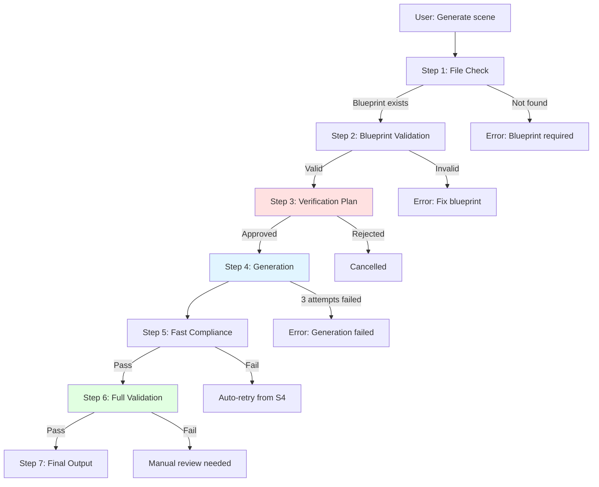

# Generation Workflow - Обзор

!!! info "Версия"

    Generation Workflow 3.0 с интеграцией FEAT-0001 (Reliable Scene Generation)

## Что это?

Generation Workflow создаёт готовый литературный текст на основе детального blueprint с гарантированным соблюдением всех критических требований.

### Ключевые улучшения (FEAT-0001)

**Проблема решена:**

- ❌ **БЫЛО**: ИИ систематически нарушал blueprint (неправильные локации, удалённые персонажи, изменённые механики)
- ✅ **СТАЛО**: Многоступенчатая валидация с автоматической регенерацией при ошибках

**Основные возможности:**

- **Автор в контроле**: Blueprint = единственный источник сюжетных решений
- **Verification Plan**: Человек утверждает план ПЕРЕД генерацией (прозрачность)
- **Fast-Fail Validation**: Ошибки ловятся за <30 сек, автоматическая регенерация
- **Constraint Compliance**: >95% успех с первой попытки (vs. ~60% раньше)

## Когда использовать

### Сценарий 1: Генерация сцены по blueprint

**Когда**:

- Blueprint уже создан (через `/plan-story` или вручную)
- Файл `acts/act-N/chapters/chapter-NN/scenes/scene-NNNN-blueprint.md` существует

**Триггер**:

```
User: "Сгенерируй сцену 0204"
User: "Generate scene 0204"
```

**Процесс**: Запускается полный 7-шаговый workflow FEAT-0001

### Сценарий 2: Попытка генерации без blueprint

**Когда**:

- Пользователь запрашивает генерацию, но blueprint не существует

**Поведение**:

```
❌ ERROR: Blueprint not found

File `acts/act-1/chapters/chapter-02/scenes/scene-0204-blueprint.md` does not exist.

Generation without blueprint is prohibited (plot control).

ACTIONS:
1. Create blueprint: /plan-story
2. Use existing blueprint from another location
3. Cancel generation

What do you want to do?
```

## 7-шаговый процесс



### Step 1: File Check (5 сек)

Проверяет существование blueprint файла.

**Агент**: Встроенная логика (не агент)

**Входы**:

- Scene ID (например, "0204")

**Выходы**:

- ✅ Blueprint path если файл существует
- ❌ Error если файл не найден

**Пример**:

```
✅ Blueprint found: acts/act-1/chapters/chapter-02/scenes/scene-0204-blueprint.md
```

### Step 2: Blueprint Validation (15 сек)

Автоматическая валидация blueprint на структурную полноту и согласованность.

**Агент**: `blueprint-validator`

**Проверяет**:

- Наличие всех обязательных секций
- Согласованность персонажей
- Логику сюжета
- Качество constraints

**Выход**:

- `constraints-list.json` — список constraint'ов для проверки
- Validation report

**Пример вывода**:

```
✅ Blueprint validation passed

Constraints extracted:
- Characters: 4 (Alexa Wright, Sebastian Grey, David Carroll, Marcus Chen)
- Location: Tower of Scholars, Level 42
- Time constraints: 2 hours scene duration
- Key events: 3 mandatory plot points
```

[Подробнее →](seven-steps.md#step-2-blueprint-validation)

### Step 3: Verification Plan (30 сек - HUMAN APPROVAL)

**Критический шаг**: Требует одобрения человека.

**Агент**: `verification-planner`

**Что показывает**:

- Какие аспекты будут проверяться
- Какие constraints применяются
- Ожидаемые validation rules

**Пример**:

```
📋 Verification Plan for Scene 0204

Will verify:
✓ Character voices consistency (Alexa, Sebastian, David, Marcus)
✓ Temporal logic (no time travel paradoxes)
✓ Canon compliance (levels 0-2)
✓ Location details accuracy (Tower of Scholars)
✓ Sensory details richness
✓ Emotional arc progression

Proceed with generation? (yes/no)
```

!!! warning "Ваше одобрение обязательно"

    Генерация **НЕ начнётся** без вашего явного `yes`.

[Подробнее →](seven-steps.md#step-3-verification-plan)

### Step 4: Generation (2-4 минуты)

Генерация литературного текста прозы.

**Агент**: `prose-writer`

**Особенности**:

- До 3 автоматических попыток при сбоях
- Соблюдение всех constraints из blueprint
- Применение prose style guide

**Пример вывода**:

```
🎨 Generating prose...

Attempt 1/3...
✅ Success (2,847 words generated)

Saved to: workspace/generation-runs/2025-11-16-143022-scene-0204/prose.md
```

[Подробнее →](seven-steps.md#step-4-generation)

### Step 5: Fast Compliance Check (30 сек)

Быстрая поверхностная проверка на грубые ошибки.

**Агент**: `blueprint-compliance-fast-checker`

**Проверяет**:

- Наличие обязательных персонажей
- Правильность локации
- Соответствие ключевым событиям
- Грубые нарушения style guide

**Поведение при сбое**:

- ❌ Fail → Автоматический переход обратно к Step 4 (новая попытка)
- ✅ Pass → Переход к Step 6

**Пример**:

```
⚡ Fast compliance check...

Checking mandatory elements:
✅ All 4 characters present
✅ Location correct (Tower of Scholars, Level 42)
✅ 3/3 key events included
✅ No obvious style violations

Fast check passed.
```

[Подробнее →](seven-steps.md#step-5-fast-compliance-check)

### Step 6: Full Validation (1-2 минуты)

Глубокая валидация прозы через 7 параллельных валидаторов.

**Агенты** (параллельно):

1. `canon-guardian` — соответствие канону
2. `character-state` — консистентность персонажей
3. `dialogue-analyst` — качество диалогов
4. `chronicle-keeper` — temporal logic
5. `emotional-arc-designer` — эмоциональная прогрессия
6. `sensory-designer` — сенсорные детали
7. `plot-architect` — сюжетная согласованность

**Выход**:

- Unified validation report
- Список warnings (non-blocking)
- Список errors (if any)

**Пример**:

```
🔍 Full validation (7 validators in parallel)...

✅ Canon compliance: PASS
✅ Character consistency: PASS
⚠️  Dialogue quality: PASS (minor: 2 weak exchanges)
✅ Temporal logic: PASS
✅ Emotional arc: PASS
✅ Sensory details: PASS
✅ Plot consistency: PASS

Overall: PASS (7/7 validators)
Warnings: 2 minor (review recommended but not blocking)
```

[Подробнее →](seven-steps.md#step-6-full-validation)

### Step 7: Final Output (5 сек)

Сохранение результата и создание финального отчёта.

**Действия**:

1. Копирует prose из workspace в финальную локацию
2. Создаёт metadata файл
3. Показывает summary report

**Файлы**:

- `acts/act-N/chapters/chapter-NN/content/scene-NNNN.md` — финальный текст
- `workspace/generation-runs/{timestamp}-scene-NNNN/metadata.json` — метаданные

**Пример вывода**:

```
✅ Scene 0204 generated successfully

📄 Output: acts/act-1/chapters/chapter-02/content/scene-0204.md

📊 Statistics:
  - Words: 2,847
  - Characters: 4 (Alexa Wright, Sebastian Grey, David Carroll, Marcus Chen)
  - Location: Tower of Scholars, Level 42
  - Duration: 6m 23s
  - Validation: All passed (7/7)
  - Warnings: 2 minor (review recommended)

📝 Next steps:
  1. Review generated text
  2. Check validation warnings
  3. Make manual edits if needed
  4. Proceed to next scene
```

[Подробнее →](seven-steps.md#step-7-final-output)

## Принципы

### Blueprint as Single Source of Truth

ИИ **НЕ добавляет** сюжетные решения. Всё определяется blueprint.

### Human-in-the-Loop

Verification plan (Step 3) требует человеческого одобрения.

### Fail-Fast

Ранняя валидация (Step 5) предотвращает дорогие ошибки.

### Artifact System

Агенты передают file paths, не данные (для текста >100 строк).

### Isolated Contexts

Каждый агент получает **только** необходимые файлы.

### Observability

Все шаги логируются в `workspace/logs/` и `workspace/generation-runs/`.

## Производительность

**Ориентировочное время** (сцена 2,000-3,000 слов):

| Этап | Время |
|------|-------|
| Step 1: File Check | 5 сек |
| Step 2: Blueprint Validation | 15 сек |
| Step 3: Verification Plan | 30 сек (human) |
| Step 4: Generation | 2-4 мин |
| Step 5: Fast Compliance | 30 сек |
| Step 6: Full Validation | 1-2 мин |
| Step 7: Final Output | 5 сек |
| **TOTAL** | **5-8 минут** |

## Следующие шаги

<div class="grid cards" markdown>

-   [:octicons-checklist-24: 7 Steps Details](seven-steps.md)
-   [:octicons-sync-24: Validation & Recovery](validation-recovery.md)
-   [:octicons-alert-24: Error Handling](error-handling.md)
-   [:octicons-file-code-24: Technical Details](../../technical/architecture/generation-workflow.md)

</div>

---

!!! tip "Полная техническая документация"

    Для подробной технической спецификации см. [`.workflows/generation.md`](../../technical/architecture/generation-workflow.md) и [FEAT-0001](../../features/feat-0001/index.md).
